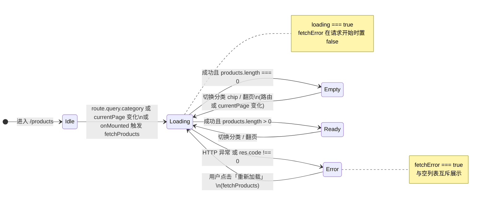

# 商品列表页 UI 状态

`ProductList.vue` / `ProductList_1.vue` 中，主列表区域通过计算属性 `listUiState` 在四种互斥状态间切换，与「接口失败」和「当前分类无商品」区分。

## 状态机（Mermaid）

## 状态与界面

| `listUiState` | 条件 | 主区域展示 |
|---------------|------|------------|
| `loading` | `loading === true` | 「加载中…」 |
| `error` | `!loading && fetchError` | 错误说明 + 「重新加载」 |
| `empty` | `!loading && !fetchError && products.length === 0` | 空态框 + 流程示意（选分类 → 看列表 → 进详情） |
| `ready` | `!loading && !fetchError && products.length > 0` | 商品网格；分页仅在 `ready` 且 `totalPages > 1` 时显示 |

## 路由与数据

- `activeCategory` 来自 `route.query.category`（字符串且非空）。
- `watch([currentPage, () => route.query.category], fetchProducts, { immediate: true })`：分类或页码变化会重新请求。
- 单独 `watch` `route.query.category` 会将 `currentPage` 重置为 `1`，避免换分类后仍停留在旧页。
